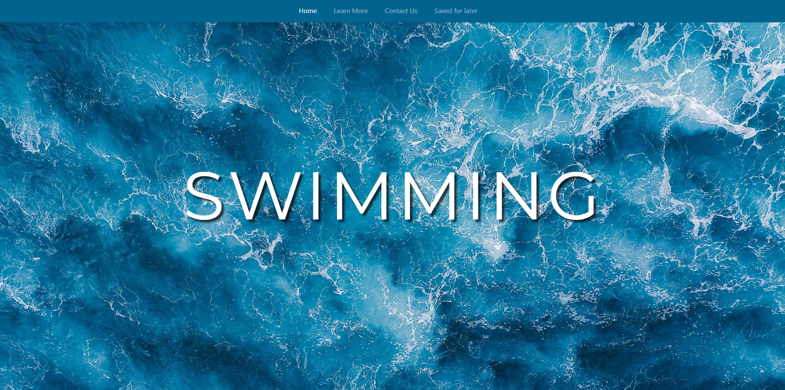
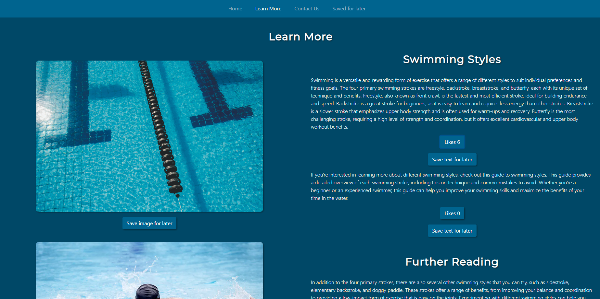
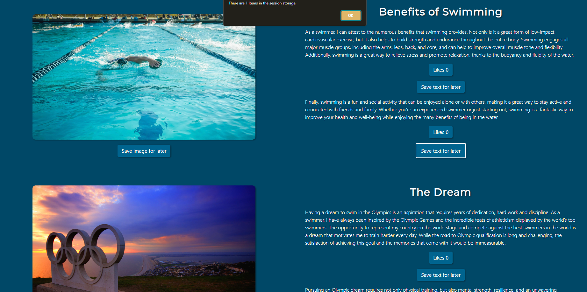

# Hobby Website

Website dedicated to a hobby of mine. Developed using HTML, CSS & JavaScript.

## Live Link
[Link](https://65d1b84628293d285acb904f--voluble-piroshki-c475fd.netlify.app)

## Features

- Session storage for 'save for later' functionality.
- `Like` button/counter enabled on content.
- JavaScript further enables interactivity with content.
- Responsive design.

## Usage

- Clone the repository.
- Run locally with via `index.html`.

## Screenshots

*Screenshot 1: Landing page*

*Screenshot 2: Added likes to content, saved in session storage*

*Screenshot 3: Adding a item to session storage*

*Screenshot 3: View session storage*
